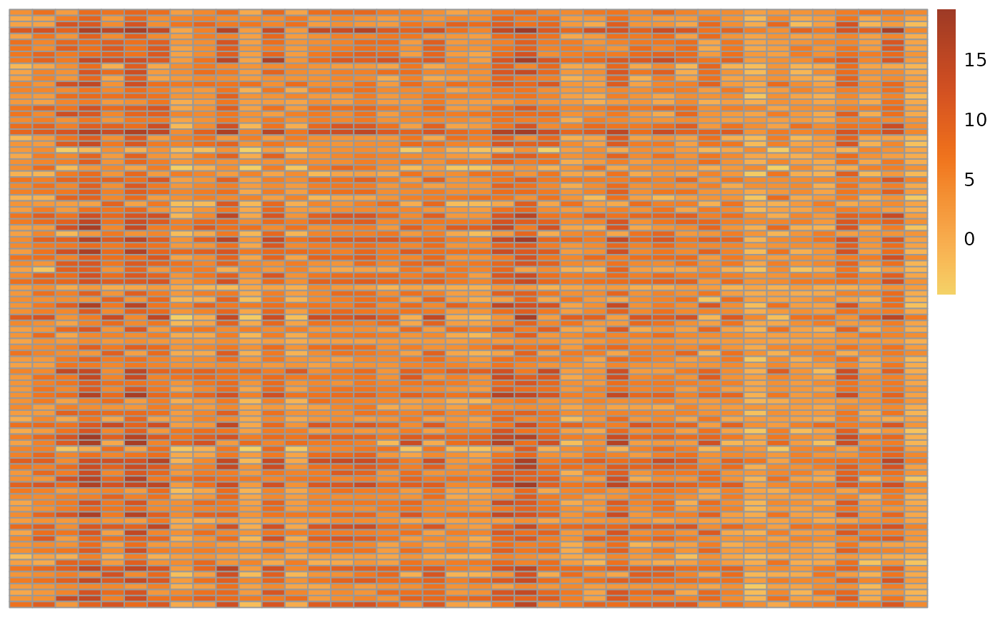
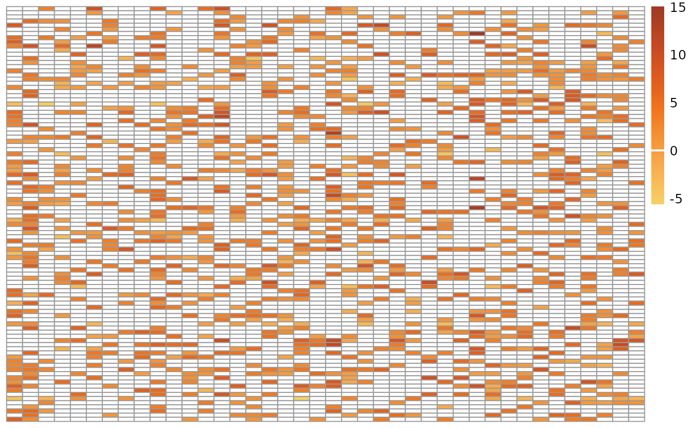
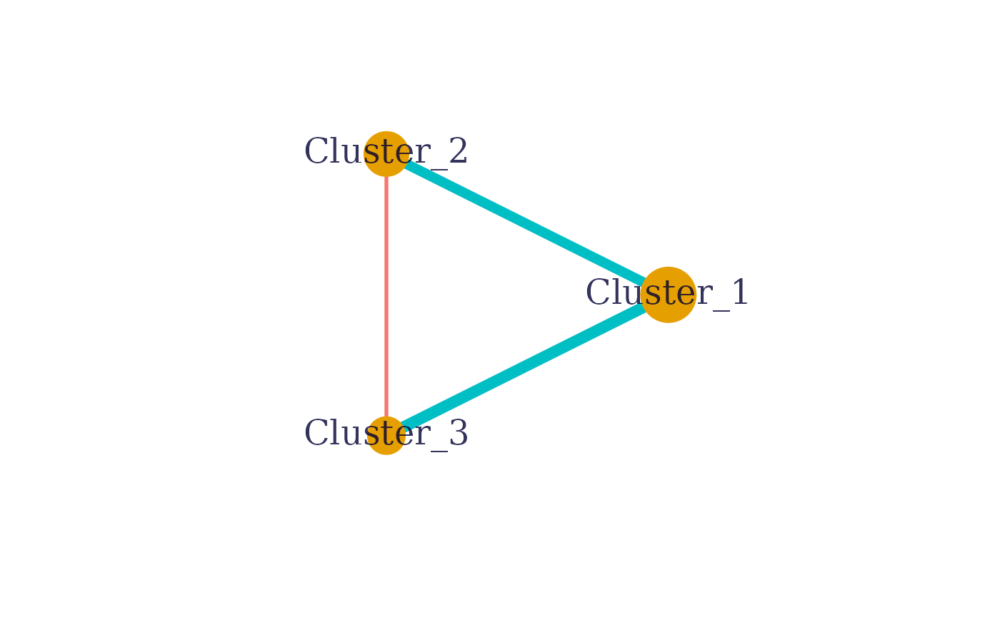
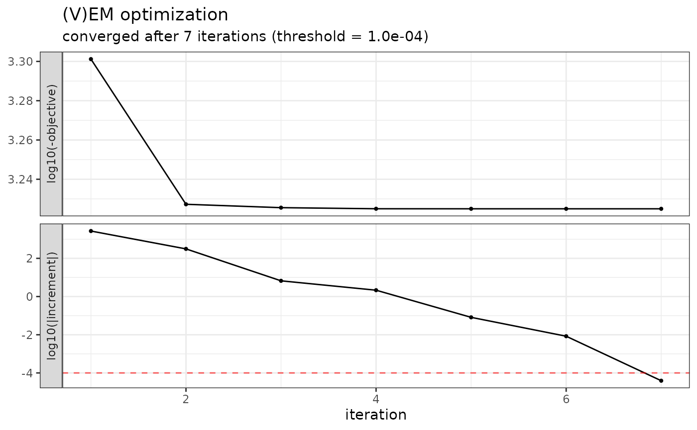
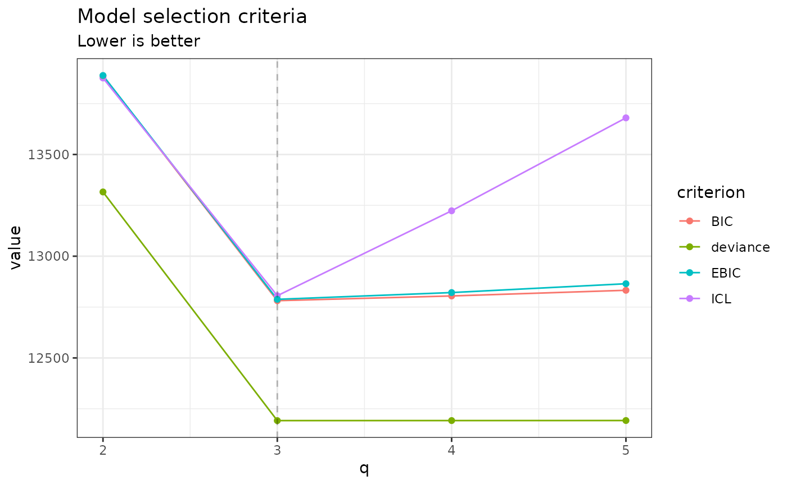
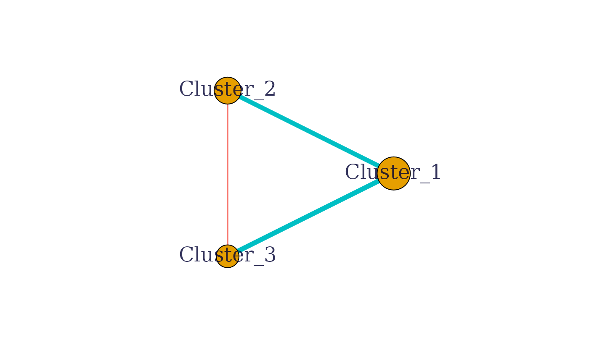
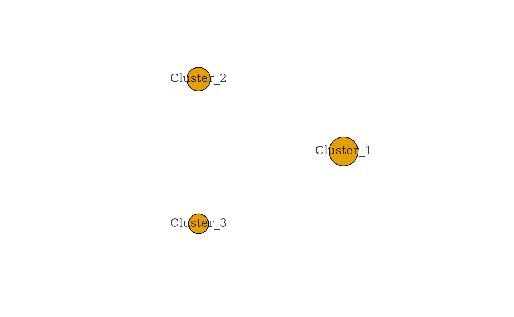
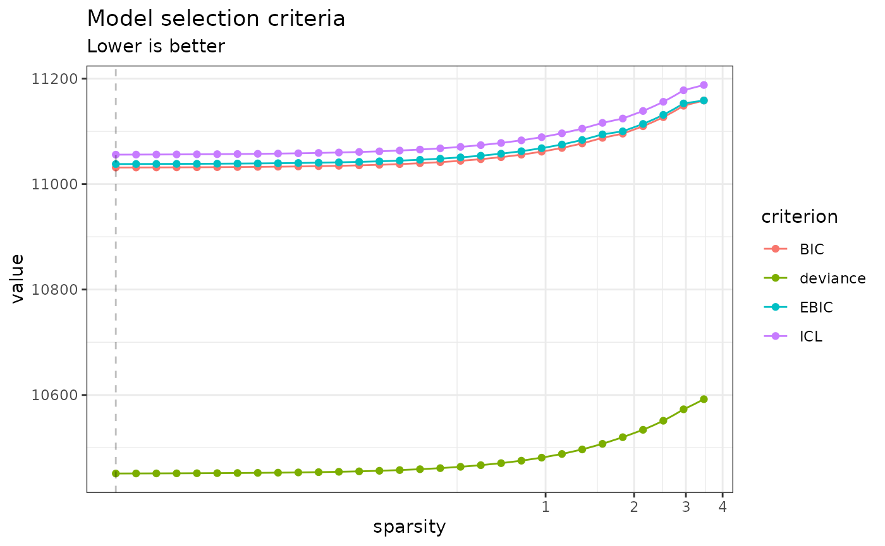
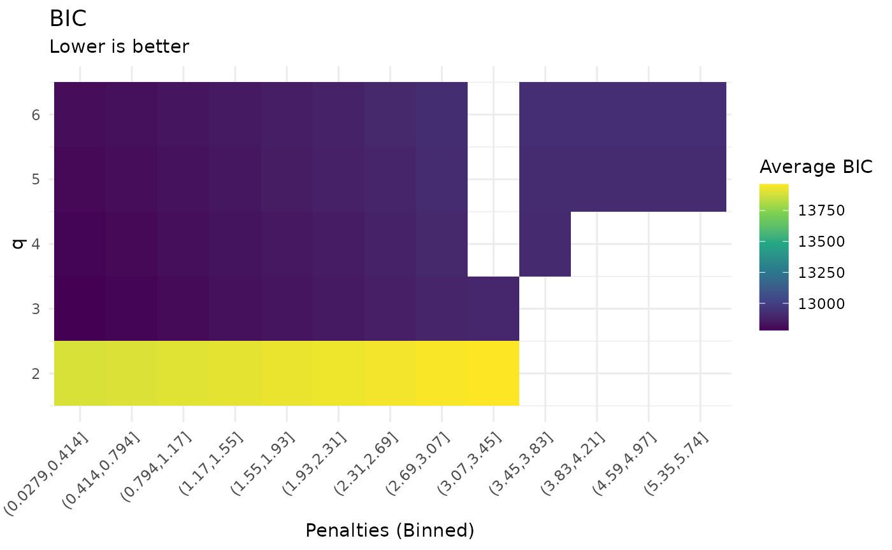

# Analyzing multivariate Gaussian data with the Normal-Block model - First steps

## Preliminaries

This vignette illustrates the use of the normal-block function and the
methods accompanying the R6 normal-block classes.

From a statistical point of view, the function normal-block adjusts a
multivariate Normal-Block model (Gaussian graphical model with a latent
clustering structure) to a table of observations, possibly after
correcting for the effects of covariates. Depending on the parameters
given, the function uses the clustering that is given or infers one,
integrates zero-inflation or not, infers a sparse network or not… The
parameters inference can either be done with an integrated variational
Expectation-Maximization approach (recommended) or with a heuristic
approach.

Theoretical explanations for this model can be found in the pre-print
“An integrated method for clustering and association network inference”
(Chiquet et al., 2024).

#### Requirements

``` r

library(normalblockr)
library(pheatmap)
library(paletteer)
```

## Data simulation

We illustrate the analysis with two simulated datasets.

Fix the seed to make the results reproducible.

``` r

set.seed(1)
```

Simulate data with generate_normal_block_data.

### Fix simulation parameters

Several parameters need to be defined to simulate the data:

``` r

n = 100 # Number of samples (number of rows in the matrix of observations)
p = 40  # Number of entities observed (number of columns in the matrix of observations)
d = 2   # Number of covariates
Q = 3   # Number of clusters
kappa = 0 # Mean zero-inflation probability (can also be a vector to define one ZI-probability for each variable). kappa = 0 means that there is no zero-inflation.
omega_structure = "erdos-renyi" # Network structure.
u_v = c(0.3, 0.1) # Parameters to generate an association matrix from a graph, details given in the bibliography.
SNR = 0.75 # Signal to Noise Ratio, defines the relative weight of the covariates and the variance
alpha = rep(1/Q, Q) # Vector giving probabilities of belonging to each cluster
range_X = c(0, 10)  # Min and max values for the covariates 
range_D = c(0.5, 1.5) # Min and max values for the individual entities variances 
```

### Simulation 1 (no zero-inflation)

**generate_normal_block_data** generates data under the Normal-Block
model. It returns a list that contains the simulated covariates $`X`$
and observations $`Y`$, the simulation parameters (including the
clustering $`C`$).

``` r

my_nb_data <- generate_normal_block_data(n, p, d, Q, kappa, omega_structure, u_v,
                                        SNR, alpha, range_X, range_D)
```

``` r

pheatmap::pheatmap(my_nb_data$Y, 
                   color =paletteer::paletteer_c("ggthemes::Orange-Gold", n = 100), cluster_rows = FALSE, cluster_cols = FALSE, show_rownames = FALSE)
```



### Simulation 2 (with zero-inflation)

To generate zero-inflated data, we set-up kappa as a vector of
zero-inflation probabilities. One needs to ensure that these values are
between 0 and 1.

``` r

kappa_zi <- rnorm(p, mean = 0.7, sd = 0.05)
kappa_zi <- unlist(lapply(kappa_zi, f <- function(x) return(max(0, min(x, 0.9)))))
my_nb_data_zi <- generate_normal_block_data(n, p, d, q = 5, kappa_zi, omega_structure,
                                            u_v, SNR, alpha, range_X, range_D)
```

For a better visualization of the zero-inflated data, we set-up the 0 to
be shown in white.

``` r

min_val <- min(my_nb_data_zi$Y) ; max_val <- max(my_nb_data_zi$Y)
orange_gold_pal <- paletteer::paletteer_c("ggthemes::Orange-Gold", n = 100)
n_breaks <- 100
zero_pos <- round((0 - min_val) / (max_val - min_val) * n_breaks) + 1
custom_pal <- c(orange_gold_pal[1:(zero_pos - 1)], "white", orange_gold_pal[zero_pos:n_breaks])
pheatmap::pheatmap(my_nb_data_zi$Y,
                   color = custom_pal,
                   cluster_rows = FALSE, cluster_cols = FALSE,
                   show_rownames = FALSE)
```



## Prepare the data for a normal-block analysis

A specific data object of class **NormalBlockData** needs to be created
to analyse the data with normalblockr.

One can either use Y and X only to generate the **NormalBlockData**
object.

``` r

my_data    <- NormalBlockData$new(my_nb_data$Y, my_nb_data$X)
my_data_zi <- NormalBlockData$new(my_nb_data_zi$Y, my_nb_data_zi$X)
```

Alternatively, if one only wants to include some of the covariates
contained in X, a formula can be used to specify which one:

``` r

colnames(my_data$X) <- c("X1", "X2")
my_data_alt    <- NormalBlockData$new(my_data$Y, my_data$X, formula = ~ 0 + X1)
```

## Run a normal-block analysis

All normal-block analyses can be run with the **normal_block** function.
The function is called with different parametrisations depending on
whether the clustering or the number of clusters is known or not, and
according to the requested level of sparsity, among other factors.
Details about this can be found in the function’s documentation.

By default, the parameters are inferred using a variational Expectation
Maximization approach with 100 iterations. A finer control of the
optimization is possible with the **control** parameter of
**normal_block** that must be a list generated by the **NB_control**
function.

### With non-zero-inflated data

#### Fixed clustering

When the variables’ clustering is known, one can directly give them as
an input to the **normal_block** function.

``` r

my_NB <- normal_block(data = my_data,
                      blocks = my_nb_data$parameters$C)
#> Fitting a diagonal normal-block model with fixed blocks 
#> 
#> DONE
```

The model convergence can be checked with **plot**.

``` r

plot(my_NB)
```


A summary of the results is accessible via **print**.

``` r

print(my_NB)
#> A diagonal normal-block model with fixed blocks .
#> ===========================================================================
#>  nb_param q n_edges sparsity   loglik deviance      BIC      ICL     EBIC niter
#>       126 3       3        0 -5225.34 10450.68 11030.93 11055.14 11037.52    12
#> ===========================================================================
#> * Useful fields
#>     $model_par, $posterior_par / $var_par, $clustering 
#>     $loglik, $BIC, $ICL, $objective, $nb_param, $criteria
#> * Useful S3 methods
#>     print(), coef(), sigma(), fitted(), predict()
```

The inter-clusters association network can be visualized with the
**plot_network** function.

``` r

 my_NB$plot_network()
#> Warning: vertex attribute frame.color contains NAs. Replacing with
#> default value black
```



#### Fixed number of clusters

When the variables’ clustering is unknown, one can simply fix the number
of clusters in the **blocks** parameter.

``` r

my_NB <- normal_block(data = my_data,
                      blocks = 3)
#> Fitting a diagonal normal-block model with 3 unknown blocks 
#> 
#> DONE
print(my_NB)
#> A diagonal normal-block model with 3 unknown blocks .
#> ===========================================================================
#>  nb_param q n_edges sparsity    loglik deviance      BIC      ICL     EBIC
#>       128 3       3        0 -6095.989 12191.98 12781.44 12805.71 12788.03
#>  niter
#>      7
#> ===========================================================================
#> * Useful fields
#>     $model_par, $posterior_par / $var_par, $clustering 
#>     $loglik, $BIC, $ICL, $objective, $nb_param, $criteria
#> * Useful S3 methods
#>     print(), coef(), sigma(), fitted(), predict()
plot(my_NB)
```

 The clustering
inferred by the **normal_block** function can be compared with the real
clustering if it is known.

``` r

aricode::ARI(my_NB$clustering, apply(my_nb_data$parameters$C, 1, which.max))
#> [1] 1
```

#### Unknown number of clusters

When the number of clusters is unknown, one can give the
**normal_block** function a range of possible numbers and get a
collection of Normal-Block models, one per number of clusters.

``` r

my_NB_unknown <- normal_block(data = my_data,
                      blocks = 2:5)
#> Fitting a diagonal normal-block model with unknown q 
#>   number of blocks = 2                number of blocks = 3                number of blocks = 4                number of blocks = 5           
#> DONE
```

**my_NB_unknown** is a collection of Normal-Block models. It is possible
to select a specific one either by picking a number of clusters or by
selecting the best model for a given criterion (BIC, deviance, EBIC,
ICL). The values for these criteria for each model can be seen with the
**plot** function.

``` r

plot(my_NB_unknown)
```



The model selection is done with **get_model** when a specific number of
clusters is required and with **get_best_model** to select the best
model for a given criterion.

``` r

myNB_3   <- my_NB_unknown$get_model(3)
myNB_BIC <- my_NB_unknown$get_best_model("BIC")
```

#### Playing with sparsity

By default, no penalty is applied on the association network. One can
add a penalty by using the sparsity parameter of the **normal_block**
function. This can be done with any of the above parametrisation (fixed
clustering, fixed number of clusters, unknown number of clusters). Let
us show an example with a fixed clustering.

If one wants to use a fixed $`l_1`$ penalty (see Tous & Chiquet, 2024)
on the network, that value should be given in the sparsity parameter.

``` r

my_NB_sparse_low <- normal_block(data = my_data,
                                 blocks = my_nb_data$parameters$C,
                                 sparsity = 0.1)
#> Fitting a diagonal normal-block model with fixed blocks 
#> 
#> DONE
my_NB_sparse_high <- normal_block(data = my_data,
                                  blocks = my_nb_data$parameters$C,
                                  sparsity = 10)
#> Fitting a diagonal normal-block model with fixed blocks 
#> 
#> DONE
```

The bigger the penalty, the sparser the network.

``` r

my_NB_sparse_low$plot_network()
#> Warning: vertex attribute frame.color contains NAs. Replacing with
#> default value black
```



``` r

my_NB_sparse_high$plot_network()
#> Warning: vertex attribute label.cex contains NAs. Replacing with default
#> value 1
#> Warning: vertex attribute frame.color contains NAs. Replacing with
#> default value black
```


It is usually hard to know a priori what would be the best sparsity
penalty. One can allow the **normal_block** function to explore
different sparsity levels by simply setting **sparsity = TRUE**. The
**normal_block** function then creates a collection of Normal-Block
models, one per sparsity penalty.

``` r

my_NB_sparse <- normal_block(data = my_data,
                             blocks = my_nb_data$parameters$C,
                             sparsity = TRUE)
#> Fitting a Collection of diagonal normal-block models with fixed blocks, with different sparsity penalties. 
#>   penalty = 3.454062              penalty = 2.946895              penalty = 2.514196              penalty = 2.145031              penalty = 1.830072              penalty = 1.561358              penalty = 1.332101              penalty = 1.136505              penalty = 0.9696299             penalty = 0.8272571             penalty = 0.7057891             penalty = 0.6021566             penalty = 0.5137407             penalty = 0.438307              penalty = 0.3739494             penalty = 0.3190416             penalty = 0.2721961             penalty = 0.2322289             penalty = 0.1981303             penalty = 0.1690384             penalty = 0.1442181             penalty = 0.1230423             penalty = 0.1049757             penalty = 0.08956189                penalty = 0.07641132                penalty = 0.06519169                penalty = 0.05561945                penalty = 0.04745273                penalty = 0.04048514                penalty = 0.03454062           
#> DONE
```

The different criteria can then be plotted as a function of the penalty,
using **plot**.

``` r

plot(my_NB_sparse)
```


Penalty selection can be done similarly to the selection of the number
of clusters.

``` r

myNB_sparse_0.1   <- my_NB_sparse$get_model(0.1)
#> No model with this penalty in the collection. Returning model with closest penalty: 0.104975695166381 Collection penalty values can be found via $sparsity
myNB_sparse_BIC   <- my_NB_sparse$get_best_model("BIC")
```

One can also make both the sparsity penalty and the number of clusters
vary.

``` r

my_NB_sparse_unknown <-  normal_block(data = my_data,
                                      blocks = 2:6,
                                      sparsity = TRUE)
#> Fitting a Collection of   diagonal normal-block models with different values of q and different penalties. 
#>   number of blocks = 2                penalty = 3.364992              penalty = 2.870903              penalty = 2.449362              penalty = 2.089717              penalty = 1.782879              penalty = 1.521095              penalty = 1.29775               penalty = 1.107198              penalty = 0.944626              penalty = 0.8059245             penalty = 0.6875889             penalty = 0.5866287             penalty = 0.5004928             penalty = 0.4270043             penalty = 0.3643064             penalty = 0.3108145             penalty = 0.2651769             penalty = 0.2262404             penalty = 0.1930211             penalty = 0.1646794             penalty = 0.1404991             penalty = 0.1198694             penalty = 0.1022687             penalty = 0.08725235                penalty = 0.0744409             penalty = 0.06351058                penalty = 0.05418519                penalty = 0.04622906                penalty = 0.03944115                penalty = 0.03364992                number of blocks = 3                penalty = 3.452901              penalty = 2.945904              penalty = 2.513351              penalty = 2.14431               penalty = 1.829456              penalty = 1.560833              penalty = 1.331653              penalty = 1.136123              penalty = 0.9693039             penalty = 0.8269789             penalty = 0.7055518             penalty = 0.6019542             penalty = 0.5135679             penalty = 0.4381597             penalty = 0.3738237             penalty = 0.3189344             penalty = 0.2721046             penalty = 0.2321509             penalty = 0.1980637             penalty = 0.1689815             penalty = 0.1441696             penalty = 0.1230009             penalty = 0.1049404             penalty = 0.08953178                penalty = 0.07638563                penalty = 0.06516977                penalty = 0.05560075                penalty = 0.04743677                penalty = 0.04047153                penalty = 0.03452901                number of blocks = 4                penalty = 3.48963               penalty = 2.97724               penalty = 2.540086              penalty = 2.167119              penalty = 1.848917              penalty = 1.577436              penalty = 1.345818              penalty = 1.148209              penalty = 0.9796146             penalty = 0.8357757             penalty = 0.7130569             penalty = 0.6083573             penalty = 0.5190309             penalty = 0.4428204             penalty = 0.3778002             penalty = 0.322327              penalty = 0.274999              penalty = 0.2346203             penalty = 0.2001705             penalty = 0.170779              penalty = 0.1457032             penalty = 0.1243093             penalty = 0.1060567             penalty = 0.09048415                penalty = 0.07719816                penalty = 0.06586299                penalty = 0.05619219                penalty = 0.04794137                penalty = 0.04090203                penalty = 0.0348963             number of blocks = 5                penalty = 5.733478              penalty = 4.891619              penalty = 4.173372              penalty = 3.560587              penalty = 3.037779              penalty = 2.591735              penalty = 2.211185              penalty = 1.886512              penalty = 1.609511              penalty = 1.373183              penalty = 1.171556              penalty = 0.9995338             penalty = 0.8527701             penalty = 0.727556              penalty = 0.6207274             penalty = 0.5295847             penalty = 0.4518246             penalty = 0.3854823             penalty = 0.3288811             penalty = 0.2805908             penalty = 0.239391              penalty = 0.2042407             penalty = 0.1742516             penalty = 0.1486659             penalty = 0.1268369             penalty = 0.1082132             penalty = 0.09232403                penalty = 0.07876789                penalty = 0.06720223                penalty = 0.05733478                number of blocks = 6                penalty = 5.734837              penalty = 4.892779              penalty = 4.174362              penalty = 3.561431              penalty = 3.038499              penalty = 2.592349              penalty = 2.211709              penalty = 1.886959              penalty = 1.609893              penalty = 1.373509              penalty = 1.171834              penalty = 0.9997707             penalty = 0.8529722             penalty = 0.7277285             penalty = 0.6208746             penalty = 0.5297102             penalty = 0.4519317             penalty = 0.3855736             penalty = 0.328959              penalty = 0.2806573             penalty = 0.2394478             penalty = 0.2042891             penalty = 0.1742929             penalty = 0.1487011             penalty = 0.126867              penalty = 0.1082389             penalty = 0.09234591                penalty = 0.07878656                penalty = 0.06721816                penalty = 0.05734837           
#> DONE
```

The result is a collection of normal-block models with different numbers
of clusters and ifferent penalties.

``` r

my_NB_sparse_unknown$who_am_I
#> [1] "Collection of   diagonal normal-block models with different values of q and different penalties."
```

The plot function allows one to analyse each criterion as a function of
the number of clusters and of the penalties. By default, the penalties
to be tested are computed by the **normal_block** function for each
number of clusters and they can be different from one number to another,
this explains the blanks in the plot.

``` r

plot(my_NB_sparse_unknown, "BIC")
```



Model selection is also done using the **get_model** and
**get_best_model** functions. Using **get_model**, one can either fix
the n umber of clusters only and get a collection of model with
different sparsity levels, or fix both the number of clusters and the
sparsity level.

``` r

my_NB_sparse_3     <- my_NB_sparse_unknown$get_model(3)
my_NB_sparse_3_0.1 <- my_NB_sparse_unknown$get_model(3, 0.1)
#> No model with this penalty in the collection. Returning model with closest penalty: 0.104940402789111 Collection penalty values can be found via $sparsity
```

### With zero-inflated data

The process is similar with zero-inflated data but one needs to specifgy
that the data is zero-inflated in the **normal_block** function. We show
an example with a fixed number of blocks and no penalty on the network.

``` r

my_NB_zi <- normal_block(data = my_data_zi,
                         blocks = 4,
                         zero_inflation = TRUE)
#> Fitting a zero-inflated diagonal normal-block model with 4 unknown blocks 
#> 
#> DONE
```

When the data is zero-inflated, the inference process may take longer.

``` r

plot(my_NB_zi)
```


The clustering inference may also be harder.

``` r

aricode::ARI(my_NB_zi$clustering,
             apply(my_nb_data_zi$parameters$C, 1, which.max))
#> [1] 0.8440253
```
