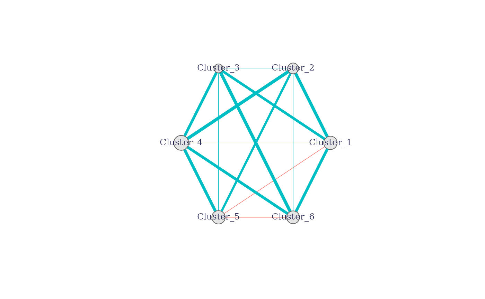
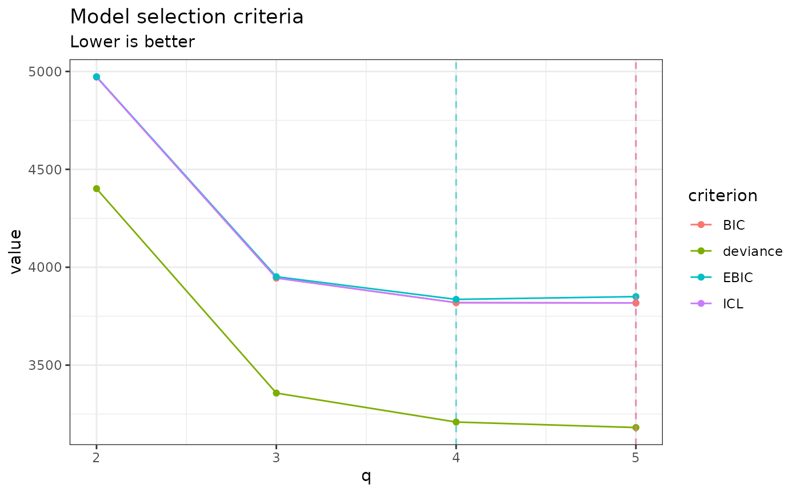
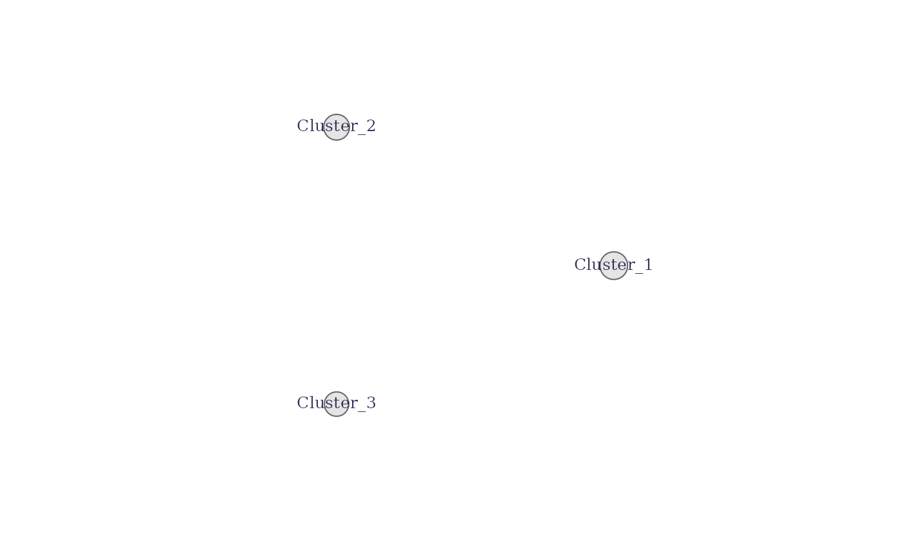
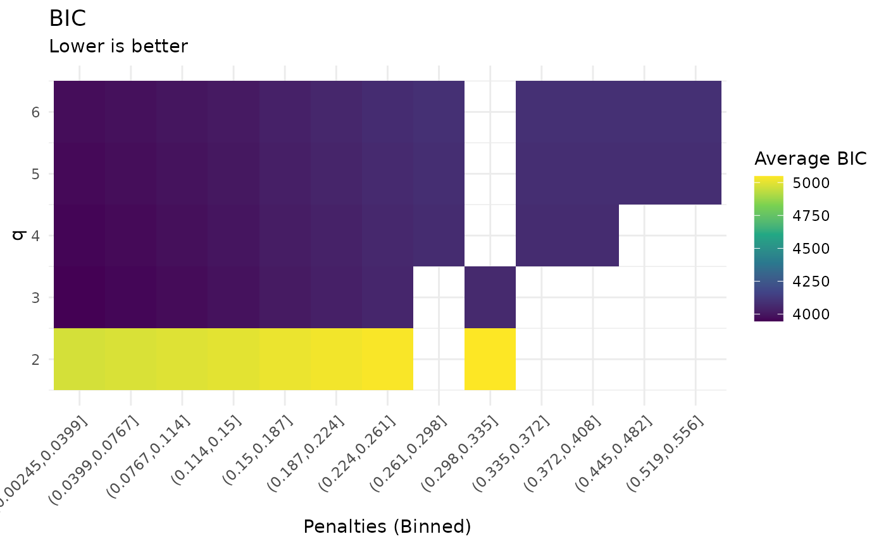

# Analyzing multivariate Gaussian data with the Normal-Block model (variance clustering) - First steps

## Preliminaries

This vignette illustrates the use of the
[`normal_block()`](https://jchiquet.github.io/normalblockr/reference/normal_block.md)
function and the methods accompanying its R6 classes.

From a statistical point of view, the
[`normal_block()`](https://jchiquet.github.io/normalblockr/reference/normal_block.md)
function fits a multivariate Normal-Block model (a Gaussian graphical
model with a latent clustering structure) to a table of observations,
possibly after correcting for the effect of covariates. Depending on the
arguments given, the function uses a clustering supplied by the user or
infers one, includes zero-inflation or not, infers a sparse network or
not, and so on. Parameter inference can either be done with an
integrated variational Expectation-Maximization approach (recommended)
or with a faster heuristic approach.

This vignette covers the default family, where the clustering structures
the *covariance* of the variables (`model = "var"`). A complementary
family clusters variables by their *response to covariates* instead
(`model = "mean"`); see
[`vignette("mean-block-breast-cancer")`](https://jchiquet.github.io/normalblockr/articles/mean-block-breast-cancer.md).

Theoretical explanations for this model and full estimation details
(criteria, E/M updates) can be found in Tous and Chiquet (2026).

#### Requirements

``` r

library(normalblockr)
library(pheatmap)
library(paletteer)
```

## Data simulation

We illustrate the analysis with two simulated datasets.

Fix the seed to make the results reproducible.

``` r

set.seed(1)
```

Simulate data with `generate_normal_block_data()`.

### Fix simulation parameters

Several parameters need to be defined to simulate the data:

``` r

n = 100 # Number of samples (number of rows in the matrix of observations)
p = 40  # Number of entities observed (number of columns in the matrix of observations)
d = 2   # Number of covariates
q = 3   # Number of clusters
kappa = 0 # Mean zero-inflation probability (can also be a vector to define one ZI-probability for each variable). kappa = 0 means that there is no zero-inflation.
omega_structure = "erdos-renyi" # Network structure.
u_v = c(0.3, 0.1) # Parameters to generate an association matrix from a graph, details given in the bibliography.
SNR = 0.75 # Signal to Noise Ratio, defines the relative weight of the covariates and the variance
alpha = rep(1/q, q) # Vector giving probabilities of belonging to each cluster
range_X = c(0, 10)  # Min and max values for the covariates
range_D = c(0.5, 1.5) # Min and max values for the individual entities variances
```

### Simulation 1 (no zero-inflation)

[`generate_normal_block_var_data()`](https://jchiquet.github.io/normalblockr/reference/generate_normal_block_var_data.md)
generates data under the Normal-Block model. It returns a list
containing the simulated covariates $`X`$ and observations $`Y`$, and
the simulation parameters (including the clustering $`C`$).

``` r

my_nb_data <- generate_normal_block_var_data(n, p, d, q, kappa, omega_structure, u_v,
                                            SNR, alpha, range_X, range_D)
```

``` r

pheatmap::pheatmap(my_nb_data$Y,
                   color =paletteer::paletteer_c("ggthemes::Orange-Gold", n = 100), cluster_rows = FALSE, cluster_cols = FALSE, show_rownames = FALSE)
```


### Simulation 2 (with zero-inflation)

To generate zero-inflated data, we set-up kappa as a vector of
zero-inflation probabilities. One needs to ensure that these values are
between 0 and 1.

``` r

kappa_zi <- rnorm(p, mean = 0.7, sd = 0.05)
kappa_zi <- unlist(lapply(kappa_zi, f <- function(x) return(max(0, min(x, 0.9)))))
my_nb_data_zi <- generate_normal_block_var_data(n = n, p = p, d = d, q = 5, kappa = kappa_zi,
                                                omega_structure = omega_structure, u_v = u_v,
                                                SNR = SNR, alpha = rep(1/5, 5),
                                                range_X = range_X, range_D = range_D)
```

For a better visualization of the zero-inflated data, we set-up the 0 to
be shown in white.

``` r

min_val <- min(my_nb_data_zi$Y) ; max_val <- max(my_nb_data_zi$Y)
orange_gold_pal <- paletteer::paletteer_c("ggthemes::Orange-Gold", n = 100)
n_breaks <- 100
zero_pos <- round((0 - min_val) / (max_val - min_val) * n_breaks) + 1
custom_pal <- c(orange_gold_pal[1:(zero_pos - 1)], "white", orange_gold_pal[zero_pos:n_breaks])
pheatmap::pheatmap(my_nb_data_zi$Y,
                   color = custom_pal,
                   cluster_rows = FALSE, cluster_cols = FALSE,
                   show_rownames = FALSE)
```


## Prepare the data for a Normal-Block analysis

A specific data object of class `NormalBlockData` needs to be created to
analyse the data with `normalblockr`.

One can use $`Y`$ and $`X`$ alone to create the `NormalBlockData`
object.

``` r

my_data    <- NormalBlockData$new(my_nb_data$Y, my_nb_data$X)
my_data_zi <- NormalBlockData$new(my_nb_data_zi$Y, my_nb_data_zi$X)
```

Alternatively, if one only wants to include some of the covariates
contained in $`X`$, a formula can be used to specify which one:

``` r

colnames(my_data$X) <- c("X1", "X2")
my_data_alt    <- NormalBlockData$new(my_data$Y, my_data$X, formula = ~ 0 + X1)
```

## Run a Normal-Block analysis

All Normal-Block analyses are run with the
[`normal_block()`](https://jchiquet.github.io/normalblockr/reference/normal_block.md)
function, called with different arguments depending on whether the
clustering (or the number of clusters) is known, and on the requested
level of sparsity, among other factors. See
[`?normal_block`](https://jchiquet.github.io/normalblockr/reference/normal_block.md)
for full details.

By default, the parameters are inferred using a variational
Expectation-Maximization approach, with up to 500 iterations. Finer
control of the optimization is possible through the `control` argument
of
[`normal_block()`](https://jchiquet.github.io/normalblockr/reference/normal_block.md),
a list generated by
[`NB_control()`](https://jchiquet.github.io/normalblockr/reference/NB_control.md).

### With non-zero-inflated data

#### Fixed clustering

When the variables’ clustering is known, it can be given directly as an
input to
[`normal_block()`](https://jchiquet.github.io/normalblockr/reference/normal_block.md).

``` r

my_NB <- normal_block(data = my_data,
                      blocks = my_nb_data$parameters$C)
#> Fitting a diagonal normal-block-var model with fixed blocks 
#> 
#> DONE
```

Convergence of the model can be checked with
[`plot()`](https://rdrr.io/r/graphics/plot.default.html).

``` r

plot(my_NB)
```


A summary of the results is accessible via
[`print()`](https://rdrr.io/r/base/print.html).

``` r

print(my_NB)
#> A diagonal normal-block-var model with fixed blocks.
#> ===========================================================================
#>  nb_param q n_edges sparsity   loglik deviance      BIC      ICL     EBIC niter
#>       126 3       3        0 -1635.17  3270.34 3850.592 3850.592 3857.183     7
#> ===========================================================================
#> * Useful fields
#>     $model_par, $posterior_par / $var_par, $clustering 
#>     $loglik, $BIC, $ICL, $objective, $nb_param, $criteria
#> * Useful S3 methods
#>     print(), summary(), plot(), coef(), sigma(), fitted(), predict()
```

[`summary()`](https://rdrr.io/r/base/summary.html) adds the cluster
sizes and the density of the network, and the usual extractors give the
estimated parameters: [`coef()`](https://rdrr.io/r/stats/coef.html) the
regression coefficients B (one column per variable, on the original
scale of $`Y`$), [`sigma()`](https://rdrr.io/r/stats/sigma.html) the
covariance of the latent cluster signals ($`\Omega^{-1}`$, one row and
column per cluster),
[`fitted()`](https://rdrr.io/r/stats/fitted.values.html) and
[`predict()`](https://rdrr.io/r/stats/predict.html) the fitted and
predicted means.

``` r

summary(my_NB)
#> A diagonal normal-block-var model with fixed blocks.
#> ===========================================================================
#>  nb_param q n_edges sparsity   loglik deviance      BIC      ICL     EBIC niter
#>       126 3       3        0 -1635.17  3270.34 3850.592 3850.592 3857.183     7
#> ===========================================================================
#> * Cluster sizes: 16, 13, 11
#> * Network: 3 edge(s), density = 1
coef(my_NB)[, 1:6]
#>           [,1]      [,2]      [,3]      [,4]      [,5]      [,6]
#> [1,] 0.6153132 0.2775232 1.0324903 0.8410484 0.8888033 0.6505552
#> [2,] 0.1145370 0.7598555 0.1277465 1.0402634 0.3243935 1.1249223
sigma(my_NB)
#>            Cluster_1  Cluster_2  Cluster_3
#> Cluster_1  0.4892297 -0.3007892 -0.3000946
#> Cluster_2 -0.3007892  0.3970011  0.2186517
#> Cluster_3 -0.3000946  0.2186517  0.3593416
```

Within a cluster, the model makes every pair of variables co-vary
positively. `within_block_correlations()` compares the empirical
correlations of the residuals with those the model implies, block by
block, to check this on a given clustering:

``` r

my_NB$within_block_correlations()
#>   block size  mean_cor   min_cor prop_negative model_cor
#> 1     1   16 0.8710036 0.8043687             0 0.8339883
#> 2     2   13 0.8022988 0.6400912             0 0.7602762
#> 3     3   11 0.7991360 0.7233014             0 0.7693202
```

The inter-cluster association network can be visualized with the
`plot_network()` function, or extracted as a matrix with
`latent_network()`.

``` r

 my_NB$plot_network()
```



#### Fixed number of clusters

When the variables’ clustering is unknown, the number of clusters can
simply be fixed via the `blocks` argument.

``` r

my_NB <- normal_block(data = my_data,
                      blocks = 3)
#> Fitting a diagonal normal-block-var model with 3 unknown blocks 
#> 
#> DONE
print(my_NB)
#> A diagonal normal-block-var model with 3 unknown blocks.
#> ===========================================================================
#>  nb_param q n_edges sparsity    loglik deviance     BIC     ICL     EBIC niter
#>       128 3       3        0 -1678.676 3357.351 3944.98 3944.98 3951.572     7
#> ===========================================================================
#> * Useful fields
#>     $model_par, $posterior_par / $var_par, $clustering 
#>     $loglik, $BIC, $ICL, $objective, $nb_param, $criteria
#> * Useful S3 methods
#>     print(), summary(), plot(), coef(), sigma(), fitted(), predict()
plot(my_NB)
```

 The clustering
inferred by
[`normal_block()`](https://jchiquet.github.io/normalblockr/reference/normal_block.md)
can be compared with the true clustering, when it is known:

``` r

aricode::ARI(my_NB$clustering, apply(my_nb_data$parameters$C, 1, which.max))
#> [1] 1
```

#### Unknown number of clusters

When the number of clusters is unknown,
[`normal_block()`](https://jchiquet.github.io/normalblockr/reference/normal_block.md)
can be given a range of candidate values instead, returning a collection
of Normal-Block models, one per number of clusters.

``` r

my_NB_unknown <- normal_block(data = my_data,
                              blocks = 2:5)
#> Fitting a collection of diagonal normal-block-var models over q 
#>   number of blocks = 2                number of blocks = 3                number of blocks = 4                number of blocks = 5                refine(): improved 4 of 4 models
#> 
#> DONE
```

Each model of the collection is first fitted from its own initial
clustering (a $`k`$-means on the residuals, see
[`NB_control()`](https://jchiquet.github.io/normalblockr/reference/NB_control.md)),
then the whole collection is polished by `refine()`: for every $`q`$, it
tries to split a cluster of the model with $`q-1`$ clusters and to merge
two clusters of the model with $`q+1`$, and keeps a candidate when it
lowers the deviance. Since the models are nested, a deviance that
increases with $`q`$ signals a poor local optimum:
[`print()`](https://rdrr.io/r/base/print.html) reports such cases
(`deviance_violations`).

``` r

my_NB_unknown
#> A collection of diagonal normal-block-var models over q 
#> ===========================================================================
#>   4 model(s) explored
#>     q ranging from 2 to 5 
#> ===========================================================================
#> * Useful fields
#>     $models, $criteria
#> * Useful methods
#>     print(), summary(), plot(), $get_best_model()
```

A specific model can be selected either by its number of clusters or as
the best model for a given criterion (BIC, ICL or EBIC). The value of
each criterion, for every model in the collection, can be visualized
with [`plot()`](https://rdrr.io/r/graphics/plot.default.html).

``` r

plot(my_NB_unknown)
```



Model selection is done with
[`get_model()`](https://jchiquet.github.io/normalblockr/reference/get_model.md)
when a specific number of clusters is required, and with
`get_best_model()` to select the best model for a given criterion.

``` r

myNB_3   <- my_NB_unknown$get_model(3)
myNB_BIC <- my_NB_unknown$get_best_model("BIC")
```

The criteria above rest on penalties. Cross-validation offers a
penalty-free alternative:
[`normal_block_cv()`](https://jchiquet.github.io/normalblockr/reference/normal_block_cv.md)
fits the collection on all folds but one and computes the exact
log-likelihood of the left-out observations (for the variance-block
model, the marginal over the latent factors, computed at the selected
partition). It typically plateaus beyond the true number of clusters, so
the one-standard-error rule picks the smallest $`q`$ within one standard
error of the best.

``` r

set.seed(1)
my_NB_cv <- normal_block_cv(my_data, blocks = 2:5, folds = 5)
my_NB_cv
#> Cross-validated log-likelihood, 5 folds (larger is better)
#>  q    loglik        se
#>  2 -6985.293 111.34704
#>  3 -6435.029  54.40782
#>  4 -6356.279  49.64443
#>  5 -6348.556  48.71834
#> Best: q = 4 (one-standard-error rule; maximum at q = 5)
plot(my_NB_cv)
```


Here every criterion selects more than the 3 simulated clusters,
cross-validation least of all. This is the default column rescaling of
$`Y`$ at work: on data simulated from the model itself, whose variables
carry their block’s signal with the same weight, rescaling makes the
model misspecified. Fitting
`NormalBlockData$new(my_nb_data$Y, my_nb_data$X, scale = FALSE)`
instead, BIC, ICL and cross-validation all select $`q = 3`$. On real
data the rescaling usually helps the variance-block model (see
[`?NormalBlockData`](https://jchiquet.github.io/normalblockr/reference/NormalBlockData.md)).

#### Playing with sparsity

By default, no penalty is applied to the association network. A penalty
can be added via the `sparsity` argument of
[`normal_block()`](https://jchiquet.github.io/normalblockr/reference/normal_block.md),
with any of the parametrizations seen above (fixed clustering, fixed
number of clusters, or unknown number of clusters). The example below
uses a fixed clustering.

To use a fixed $`\ell_1`$ penalty (Tous and Chiquet 2026) on the
network, pass that value to the `sparsity` argument:

``` r

my_NB_sparse_low <- normal_block(data = my_data,
                                 blocks = my_nb_data$parameters$C,
                                 sparsity = 0.1)
#> Fitting a diagonal normal-block-var model with fixed blocks 
#> 
#> DONE
my_NB_sparse_high <- normal_block(data = my_data,
                                  blocks = my_nb_data$parameters$C,
                                  sparsity = 10)
#> Fitting a diagonal normal-block-var model with fixed blocks 
#> 
#> DONE
```

The larger the penalty, the sparser the network.

``` r

my_NB_sparse_low$plot_network()
```


``` r

my_NB_sparse_high$plot_network()
```


It is usually hard to know a priori which sparsity penalty is best.
[`normal_block()`](https://jchiquet.github.io/normalblockr/reference/normal_block.md)
can instead explore a range of sparsity levels by simply setting
`sparsity = TRUE`, which returns a collection of Normal-Block models,
one per sparsity penalty.

``` r

my_NB_sparse <- normal_block(data = my_data,
                             blocks = my_nb_data$parameters$C,
                             sparsity = TRUE,
                             control = NB_control(verbose = FALSE))
```

The different criteria can then be plotted as a function of the penalty,
using [`plot()`](https://rdrr.io/r/graphics/plot.default.html).

``` r

plot(my_NB_sparse)
```


Penalty selection can be done similarly to the selection of the number
of clusters.

``` r

myNB_sparse_0.1   <- my_NB_sparse$get_model(0.1)
#> No model with this penalty in the collection. Returning model with closest penalty: 0.0988226469658165 Collection penalty values can be found via $sparsity
myNB_sparse_BIC   <- my_NB_sparse$get_best_model("BIC")
```

The penalty can also be chosen by stability selection (StARS, Liu et al.
(2010)): the whole path is refitted on subsamples of the observations,
with the clustering held fixed, and the selected penalty is the smallest
one whose network is stable enough (0.9 by default).

``` r

set.seed(1)
myNB_sparse_StARS <- my_NB_sparse$get_best_model("StARS")
myNB_sparse_StARS$n_edges
#> [1] 3
```

Both the sparsity penalty and the number of clusters can also be left to
vary jointly.

``` r

my_NB_sparse_unknown <-  normal_block(data = my_data,
                                      blocks = 2:6,
                                      sparsity = TRUE,
                                      control = NB_control(verbose = FALSE))
```

The result is a collection of Normal-Block models with different numbers
of clusters and different penalties.

``` r

my_NB_sparse_unknown$who_am_I
#> [1] "collection of diagonal normal-block-var models over q and sparsity penalties"
```

[`plot()`](https://rdrr.io/r/graphics/plot.default.html) allows each
criterion to be analysed as a function of both the number of clusters
and the penalty. By default, the penalties tested are computed by
[`normal_block()`](https://jchiquet.github.io/normalblockr/reference/normal_block.md)
separately for each number of clusters, and can differ from one to
another – which is what the blanks in the plot come from.

``` r

plot(my_NB_sparse_unknown, "BIC")
```



Model selection is also done using
[`get_model()`](https://jchiquet.github.io/normalblockr/reference/get_model.md)
and `get_best_model()`. With
[`get_model()`](https://jchiquet.github.io/normalblockr/reference/get_model.md),
one can fix only the number of clusters, getting back a collection of
models with different sparsity levels, or fix both the number of
clusters and the sparsity level.

``` r

my_NB_sparse_3     <- my_NB_sparse_unknown$get_model(3)
my_NB_sparse_3_0.1 <- my_NB_sparse_unknown$get_model(3, 0.1)
#> No model with this penalty in the collection. Returning model with closest penalty: 0.0987915298048486 Collection penalty values can be found via $sparsity
```

### With zero-inflated data

The process is similar with zero-inflated data, but
`zero_inflation = TRUE` must be passed to
[`normal_block()`](https://jchiquet.github.io/normalblockr/reference/normal_block.md).
The example below uses the simulated number of blocks and no penalty on
the network. See
[`vignette("zero-inflated-normal-block")`](https://jchiquet.github.io/normalblockr/articles/zero-inflated-normal-block.md)
for the model and a real-data example.

``` r

my_NB_zi <- normal_block(data = my_data_zi,
                         blocks = 5,
                         zero_inflation = TRUE)
#> Fitting a zero-inflated diagonal normal-block-var model with 5 unknown blocks 
#> 
#> DONE
```

When the data is zero-inflated, the inference process may take longer.

``` r

plot(my_NB_zi)
```


The clustering inference may also be harder.

``` r

aricode::ARI(my_NB_zi$clustering,
             apply(my_nb_data_zi$parameters$C, 1, which.max))
#> [1] 0.9110079
```

## References

Liu, Han, Kathryn Roeder, and Larry Wasserman. 2010. “Stability Approach
to Regularization Selection (StARS) for High Dimensional Graphical
Models.” *Advances in Neural Information Processing Systems* 23.

Tous, Jeanne, and Julien Chiquet. 2026. “An Integrated Method for
Clustering and Association Network Inference.” *Computational Statistics
& Data Analysis* 219: 108347.
<https://doi.org/10.1016/j.csda.2026.108347>.
